# IIT Palakkad VMS — Execution Tasks

> **Reference**: See `implementation_plan.md` for full architecture, schema, and API details.  
> **Structure**: 5 phases, each assigned to one execution agent. Phases are sequential — each depends on the previous.  
> **Deployment**: Local-only for now. Production deployment deferred.

---

## Phase 0 — Scaffold (Agent 1)

> **Goal**: Project initialization, dependencies, directory structure, database schema, config files, and shared utilities. When this phase completes, `npm run dev` should start with no errors, the database should be migrated and seeded, and all shared libraries should be importable.

### Task 0.1 — Initialize Next.js Project

**Files Created**:
- `package.json`, `tsconfig.json`, `next.config.js`, `tailwind.config.ts`
- `.eslintrc.json`, `.prettierrc`, `.gitignore`
- `src/app/layout.tsx`, `src/app/page.tsx`, `src/app/globals.css`

**Steps**:
1. Run `npx -y create-next-app@latest ./ --typescript --tailwind --eslint --app --src-dir --import-alias "@/*"` (non-interactive, must work inside the existing repo).
2. Install dev tools: `npm install -D prettier eslint-config-prettier`.
3. Create `.prettierrc`: `{ "semi": true, "singleQuote": true, "tabWidth": 2 }`.
4. Verify `npm run dev` starts on `localhost:3000`.
5. Git commit: `"Initialized Next.js 14 project with TypeScript and Tailwind"`.

**Acceptance Criteria**:
- [ ] `npm run dev` starts without errors
- [ ] `npx tsc --noEmit` passes
- [ ] Prettier formats without conflicts

---

### Task 0.2 — Install All Dependencies

**Files Modified**: `package.json`

**Steps**:
1. Production deps:
   ```
   npm install @prisma/client next-auth@5 @auth/prisma-adapter zod react-hook-form @hookform/resolvers zustand @tanstack/react-query qrcode html5-qrcode @react-pdf/renderer resend bcryptjs date-fns uuid
   ```
2. Dev deps:
   ```
   npm install -D prisma @types/bcryptjs @types/qrcode @types/uuid ts-node
   ```
3. Initialize shadcn/ui:
   ```
   npx -y shadcn@latest init
   ```
   (Default style, Slate base color, CSS variables enabled)
4. Git commit: `"Installed all project dependencies"`.

**Acceptance Criteria**:
- [ ] `npm ls` shows no critical peer dependency errors
- [ ] `npx prisma --version` succeeds

---

### Task 0.3 — Directory Structure, Config & Type Files

**Files Created**:
- `src/config/domains.ts` — `ALLOWED_DOMAINS`, `WHITELISTED_EMAILS`, `isAllowedEmail()` helper
- `src/config/feature-flags.ts` — `FeatureFlags` interface & defaults
- `src/config/email-config.ts` — reads SMTP/Resend config from `process.env`
- `src/lib/constants.ts` — role, pass type, status enums as plain TS objects
- `src/lib/prisma.ts` — PrismaClient singleton (dev hot-reload safe)
- `src/types/pass.types.ts` — `CreatePassInput`, `PassFilters`, pass-related interfaces
- `src/types/user.types.ts` — `UserProfile`, role-related types
- `src/types/api.types.ts` — `ApiResponse<T>`, `PaginatedResult<T>`, `ApiError`
- `.env.example` — all environment variable placeholders
- `.gitkeep` files in: `src/components/{ui,forms,passes,scanner,dashboard,layout}/`, `src/services/`, `src/schemas/`, `src/hooks/`, `src/stores/`, `tests/{unit,integration,e2e}/`, `public/assets/`

**Acceptance Criteria**:
- [ ] `npx tsc --noEmit` passes
- [ ] `domains.ts` exports `ALLOWED_DOMAINS = ['iitpkd.ac.in', 'smail.iitpkd.ac.in']`
- [ ] `prisma.ts` uses `globalThis` singleton pattern
- [ ] `.env.example` contains all 10+ env keys from implementation plan §7.1

Git commit: `"Created directory structure, config, and type definitions"`.

---

### Task 0.4 — Prisma Schema, Migration & Seed

**Files Created/Modified**:
- `prisma/schema.prisma` — all 7 models (`User`, `VisitorPass`, `ApprovalRequest`, `ScanLog`, `EmailLog`, `AuditLog`, `FeatureFlag`) and 6 enums
- `prisma/seed.ts` — seed 1 user per role (5 users), 2 feature flags, 3 sample passes
- `package.json` — add `prisma.seed` config

**Steps**:
1. Create `prisma/schema.prisma` with full schema from implementation plan §3.2.
2. Run `npx prisma migrate dev --name init`.
3. Create `prisma/seed.ts`:
   - 5 users (EMPLOYEE, STUDENT, OFFICIAL, SECURITY with bcrypt-hashed password, ADMIN).
   - 2 feature flags: `approval_required_student_guest` (true), `approval_required_employee_guest` (false).
   - 3 passes: 1 EMPLOYEE_GUEST (ACTIVE), 1 STUDENT_GUEST (PENDING_APPROVAL + ApprovalRequest), 1 WALKIN (ACTIVE).
4. Add to `package.json`: `"prisma": { "seed": "ts-node --compiler-options {\"module\":\"CommonJS\"} prisma/seed.ts" }`.
5. Run `npx prisma db seed`.
6. Git commit: `"Defined Prisma schema, ran initial migration, and seeded data"`.

**Acceptance Criteria**:
- [ ] `npx prisma validate` passes
- [ ] Migration applies cleanly to fresh DB
- [ ] `npx prisma db seed` completes — 5 users, 2 flags, 3 passes in DB
- [ ] Security user password is bcrypt-hashed
- [ ] All relations, indexes, and `@@map` directives correct

---

### Task 0.5 — Shared Utilities (QR, ID Generator, Zod Schemas)

**Files Created**:
- `src/lib/qr.ts` — `generateQRPayload()`, `verifyQRPayload()`, `generateQRCodeDataURL()`
- `src/lib/id-generator.ts` — `generateUniqueId()` (10-digit), `generatePassNumber()` (VMS-YYYYMMDD-XXXX)
- `src/schemas/pass.schema.ts` — Zod schemas: `basePassSchema`, `employeeGuestSchema`, `officialPassSchema`, `studentGuestSchema`, `walkinPassSchema`, `studentExitSchema`, `createPassSchema` (discriminated union), `passFiltersSchema`
- `src/schemas/user.schema.ts` — `securityLoginSchema`
- `src/schemas/scan.schema.ts` — `scanInputSchema` (scanType, gateLocation, notes)

**Steps**:
1. `qr.ts`: use `QR_HMAC_SECRET` from env. Payload format: `VMS:<passId>:<hmac-truncated>`. Use `crypto.createHmac('sha256', secret)`.
2. `id-generator.ts`: `generateUniqueId()` returns 10-digit numeric string. `generatePassNumber()` returns `VMS-YYYYMMDD-XXXX`.
3. `pass.schema.ts`: each workflow schema extends `basePassSchema`. `createPassSchema` uses `z.discriminatedUnion('passType', [...])`. Custom refinement: `visitTo` must be after `visitFrom`.
4. Git commit: `"Added QR utilities, ID generator, and Zod validation schemas"`.

**Acceptance Criteria**:
- [ ] `generateQRPayload('test-uuid')` returns `VMS:test-uuid:<checksum>`
- [ ] `verifyQRPayload` returns `{ valid: true }` for untampered payload, `{ valid: false }` for tampered
- [ ] `generateQRCodeDataURL` returns a string starting with `data:image/png;base64,`
- [ ] `generateUniqueId()` returns exactly 10 digits
- [ ] `createPassSchema` discriminates on `passType` and validates workflow-specific fields
- [ ] `visitFrom` before `visitTo` is enforced via Zod refinement

---

### Task 0.6 — Auth Configuration (NextAuth) & RBAC Middleware

**Files Created**:
- `src/lib/auth.ts` — NextAuth v5 config: Google OAuth + Credentials provider, domain validation, role assignment, JWT/session callbacks
- `src/app/api/auth/[...nextauth]/route.ts` — Route handler
- `src/lib/auth-utils.ts` — `getCurrentUser()`, `requireAuth()`, `requireRole()`
- `src/lib/api-middleware.ts` — `withAuth()`, `withRole()`, `withValidation()` wrapper functions
- `src/middleware.ts` — Next.js page-level middleware (protect `/employee/*` → EMPLOYEE, `/student/*` → STUDENT, `/security/*` → SECURITY, `/admin/*` → ADMIN)

**Steps**:
1. Configure Google OAuth: validate against `ALLOWED_DOMAINS` and `WHITELISTED_EMAILS` in `signIn` callback.
2. Credentials provider: lookup by email, compare bcrypt hash, assign SECURITY role.
3. JWT callback: persist `id`, `role`, `uniqueId`/`rollNumber`.
4. Session callback: expose `id`, `role`, `uniqueId`/`rollNumber` on session.
5. `middleware.ts`: matcher for `/(dashboard)/:path*`, redirect to `/login` if no session, check role vs route prefix.
6. `api-middleware.ts`: `withAuth(handler)` → 401 if no session. `withRole(roles, handler)` → 403 if wrong role. `withValidation(schema, handler)` → 400 with Zod errors.
7. Git commit: `"Configured NextAuth with Google OAuth, Credentials, and RBAC middleware"`.

**Acceptance Criteria**:
- [ ] `/api/auth/providers` returns `google` and `credentials`
- [ ] `@iitpkd.ac.in` → EMPLOYEE, `@smail.iitpkd.ac.in` → STUDENT, whitelisted → OFFICIAL
- [ ] Non-allowed domains are rejected
- [ ] Credentials login works for seeded security user
- [ ] Session includes `role`, `id`, `email`
- [ ] Unauthenticated access to `/employee` redirects to `/login`
- [ ] `withRole(['SECURITY'])` returns 403 for non-SECURITY users

---

## Phase 1 — Backend (Agent 2)

> **Goal**: All services (business logic) and API route handlers. When complete, every API endpoint should be callable via curl/Postman and return correct responses.

### Task 1.1 — Audit Service & Email Service

**Files Created**:
- `src/services/audit.service.ts`
- `src/services/email.service.ts`
- `src/lib/email.ts` — Resend client config
- `src/lib/email-templates/employee-guest.tsx`
- `src/lib/email-templates/official-pass.tsx`
- `src/lib/email-templates/student-guest.tsx`
- `src/lib/email-templates/walkin-pass.tsx`
- `src/lib/email-templates/student-exit.tsx`
- `src/lib/email-templates/approval-request.tsx`

**Steps**:
1. **AuditService**: `log({ userId, action, entityType, entityId, changes, ipAddress })` → creates `AuditLog` record. Fire-and-forget (non-blocking, catches errors internally).
2. **Email templates**: React Email or plain HTML. Each template renders pass details + QR code image.
3. **EmailService**:
   - `sendPassEmail(pass, passType)` — determines recipients/CC per workflow type:
     - A → employee personal email
     - B → office email, CC dept heads
     - C → student + assistant warden + 2 placeholder CCs
     - D → no auto-email
     - E → student + CC assistant warden
   - Logs each attempt to `EmailLog` table.
   - `sendApprovalRequestEmail(request)` — notifies approver.
4. Git commit: `"Implemented audit service and email service with templates"`.

**Acceptance Criteria**:
- [ ] `AuditService.log()` creates record in `audit_logs`
- [ ] Audit failures don't crash the caller
- [ ] Each email template renders valid HTML with mock data
- [ ] EmailService determines correct recipients per workflow
- [ ] EmailLog created for each send attempt

---

### Task 1.2 — Pass Service (Core CRUD + Business Logic)

**Files Created**:
- `src/services/pass.service.ts`

**Steps**:
1. `createPass(data, userId)`:
   - Validate via correct Zod schema based on `passType`.
   - Generate `passNumber` and QR code (payload + data URL).
   - STUDENT_GUEST → status = `PENDING_APPROVAL`, create `ApprovalRequest` in same transaction.
   - Others → status = `ACTIVE`.
   - Trigger email (non-blocking).
   - Create audit log.
2. `getPassById(id)` — include `createdBy`, `hostProfessor`, `approvalRequest`, `scanLogs`.
3. `listPasses(filters, page, limit)` — role-scoped: EMPLOYEE/STUDENT/OFFICIAL → own passes only; SECURITY → all active; ADMIN → all.
4. `updatePass(id, data, userId)` — only if DRAFT or ACTIVE.
5. `cancelPass(id, userId)` — set `deletedAt`, status `CANCELLED`.
6. Git commit: `"Implemented pass service with all workflow logic"`.

**Acceptance Criteria**:
- [ ] EMPLOYEE_GUEST pass created with status ACTIVE + QR code
- [ ] STUDENT_GUEST pass created with status PENDING_APPROVAL + ApprovalRequest
- [ ] `listPasses` scoped by role
- [ ] Pass number format: `VMS-YYYYMMDD-XXXX`
- [ ] Audit log created on every mutation
- [ ] `cancelPass` sets `deletedAt` and status CANCELLED

---

### Task 1.3 — Approval Service & Scan Service

**Files Created**:
- `src/services/approval.service.ts`
- `src/services/scan.service.ts`

**Steps**:
1. **ApprovalService**:
   - `getPendingApprovals(approverId)` — PENDING requests for given approver.
   - `approvePass(requestId, approverId, remarks?)` — update ApprovalRequest → APPROVED, VisitorPass → ACTIVE, trigger email, audit log. All in transaction.
   - `rejectPass(requestId, approverId, remarks)` — update → REJECTED, notify student, audit log.
2. **ScanService**:
   - `verifyAndGetPass(qrPayload)` — validate HMAC, look up pass, check ACTIVE + within time window. Return full details.
   - `logScan(passId, securityId, scanType, gateLocation?)` — create ScanLog + audit log.
   - `getScanHistory(passId)` — ordered by `scannedAt`.
   - `getRecentScans(limit)` — for security dashboard.
3. Git commit: `"Implemented approval service and scan service"`.

**Acceptance Criteria**:
- [ ] `getPendingApprovals` returns only PENDING requests for the approver
- [ ] Approving changes pass → ACTIVE, sets `decidedAt`
- [ ] Rejecting changes pass → REJECTED
- [ ] `verifyAndGetPass` rejects tampered QR payloads
- [ ] `verifyAndGetPass` rejects expired passes
- [ ] `logScan` creates ScanLog with correct scanType
- [ ] All mutations are transactional

---

### Task 1.4 — All API Route Handlers

**Files Created**:
- `src/app/api/passes/route.ts` — `POST` (create), `GET` (list)
- `src/app/api/passes/[id]/route.ts` — `GET`, `PATCH`, `DELETE`
- `src/app/api/passes/[id]/approve/route.ts` — `POST`
- `src/app/api/passes/[id]/scan/route.ts` — `POST`
- `src/app/api/passes/verify/route.ts` — `GET ?code=<qr_payload>`
- `src/app/api/users/route.ts` — `GET` (list, filterable by role)
- `src/app/api/users/me/route.ts` — `GET` (current user)
- `src/app/api/upload/photo/route.ts` — `POST` (multipart, SECURITY only)
- `src/app/api/scan-logs/route.ts` — `GET` (filtered, SECURITY/ADMIN)

**Steps**:
1. All routes use `withAuth`, role-specific routes use `withRole`.
2. POST/PATCH routes use `withValidation` with appropriate Zod schema.
3. Standard response envelope: `{ success, data, meta, error }`.
4. Error responses: `{ success: false, error: { code, message, details } }`.
5. Upload endpoint: validate JPEG/PNG, max 5MB, save to `public/uploads/`, return URL.
6. Git commit: `"Created all API route handlers with auth, validation, and error handling"`.

**Acceptance Criteria**:
- [ ] `POST /api/passes` → 201 with pass data for valid body
- [ ] `POST /api/passes` → 400 with Zod errors for invalid body
- [ ] `GET /api/passes` → paginated results with `meta`
- [ ] `GET /api/passes/:id` → 404 for non-existent
- [ ] `POST /api/passes/:id/approve` → 403 for non-ADMIN
- [ ] `POST /api/passes/:id/scan` → only SECURITY
- [ ] `GET /api/passes/verify?code=VMS:...` → pass details for valid code
- [ ] All endpoints → 401 for unauthenticated
- [ ] `POST /api/upload/photo` → 413 for files > 5MB
- [ ] `GET /api/scan-logs` → paginated, SECURITY/ADMIN only

---

## Phase 2 — Frontend (Agent 3)

> **Goal**: All UI pages, components, and client-side logic. When complete, users should be able to log in, navigate role-specific dashboards, create all 5 pass types, view pass details with QR, scan QR codes, and manage approvals.

### Task 2.1 — Login Page & Auth Layout

**Files Created/Modified**:
- `src/app/(auth)/login/page.tsx`
- `src/app/(auth)/layout.tsx`
- shadcn components installed: `button`, `input`, `card`, `separator`, `label`, `toast`

**Steps**:
1. Install shadcn components: `npx shadcn add button input card separator label toast sonner`.
2. Auth layout: clean, centered card layout.
3. Login page:
   - Google OAuth button (primary, large).
   - Separator "OR".
   - Collapsible "Security Staff Login" section: email + password fields.
   - Error/success feedback via toast.
   - Responsive (stacked on mobile).
4. Wire Google sign-in: `signIn('google')`. Wire credentials form submission.
5. Git commit: `"Built login page with Google OAuth and Security credentials form"`.

**Acceptance Criteria**:
- [ ] Login renders at `/login` without errors
- [ ] Google button triggers OAuth flow
- [ ] Security form validates empty fields client-side
- [ ] Responsive on mobile and desktop
- [ ] Error toast on failed login

---

### Task 2.2 — Dashboard Layout & Role Dashboards

**Files Created**:
- `src/app/(dashboard)/layout.tsx`
- `src/components/layout/Header.tsx`
- `src/components/layout/Sidebar.tsx`
- `src/stores/ui.store.ts`
- `src/components/dashboard/StatsCards.tsx`
- `src/components/dashboard/RecentActivity.tsx`
- `src/app/(dashboard)/employee/page.tsx`
- `src/app/(dashboard)/student/page.tsx`
- `src/app/(dashboard)/official/page.tsx`
- `src/app/(dashboard)/security/page.tsx`
- `src/app/(dashboard)/admin/page.tsx`

**Steps**:
1. Install shadcn: `npx shadcn add avatar dropdown-menu sheet tooltip badge table tabs`.
2. **Sidebar**: Role-aware nav links, collapsible on desktop, sheet on mobile, active link highlight, logo.
3. **Header**: User avatar/name dropdown (profile, logout), breadcrumbs, mobile hamburger.
4. **Dashboard layout**: Sidebar + Header + main content. Server-side session check.
5. **StatsCards**: Reusable stat cards (total passes, active, pending, scans).
6. **RecentActivity**: List of recent 5 items.
7. **Employee dashboard**: My passes stats, recent passes, "Create New Pass" button.
8. **Student dashboard**: Guest passes + exit passes stats, quick action buttons.
9. **Official dashboard**: Office pass stats, create button.
10. **Security dashboard**: Today's scans, "Scan QR" button (big), "Walk-in Pass" button.
11. **Admin dashboard**: System-wide stats, pending approvals count, recent activity.
12. `ui.store.ts`: Zustand store for sidebar open/close.
13. Git commit: `"Built dashboard layout with sidebar, header, and all role dashboards"`.

**Acceptance Criteria**:
- [ ] Sidebar shows only role-appropriate nav items
- [ ] Header shows user name, avatar, logout
- [ ] Responsive: sidebar collapses to hamburger on mobile
- [ ] Each dashboard shows stats + recent activity + quick actions
- [ ] Security dashboard highlights Scan and Walk-in actions

---

### Task 2.3 — All Pass Creation Forms (5 Workflows)

**Files Created**:
- `src/hooks/usePasses.ts` — `useCreatePass()`, `useMyPasses()`, `usePassDetail(id)`
- `src/hooks/useApprovals.ts` — `usePendingApprovals()`, `useApprovePass()`
- `src/app/(dashboard)/employee/passes/new/page.tsx`
- `src/components/forms/EmployeePassForm.tsx` — Workflow A: Name, Sex, Purpose, Visit From/To
- `src/app/(dashboard)/official/passes/new/page.tsx`
- `src/components/forms/OfficialPassForm.tsx` — Workflow B: same fields, passType OFFICIAL
- `src/app/(dashboard)/student/guest-pass/new/page.tsx`
- `src/components/forms/StudentGuestPassForm.tsx` — Workflow C: + Relation, Age, Approver dropdown, "requires approval" notice
- `src/app/(dashboard)/security/walkin/new/page.tsx`
- `src/components/forms/WalkinPassForm.tsx` — Workflow D: + Mobile, Age, ID Type/Number, Point of Contact, Phone Confirmed By, webcam capture
- `src/app/(dashboard)/student/exit-pass/new/page.tsx`
- `src/components/forms/StudentExitPassForm.tsx` — Workflow E: + Hostel Name (dropdown), auto-fill student name from session

**Steps**:
1. Install shadcn: `npx shadcn add select textarea dialog popover calendar`.
2. Each form uses React Hook Form + Zod resolver with the matching schema.
3. Date/time pickers for visit from/to.
4. Workflow C: searchable approver dropdown from `GET /api/users?role=ADMIN`.
5. Workflow D: webcam integration via `navigator.mediaDevices.getUserMedia()`, capture → upload via `POST /api/upload/photo` → store URL.
6. Workflow E: hostel name from predefined list, student name from session.
7. All forms: inline validation, loading state on submit, success toast + redirect, error toast.
8. Git commit: `"Built all 5 pass creation forms with validation and workflow logic"`.

**Acceptance Criteria**:
- [ ] All 5 forms render and validate correctly
- [ ] Workflow A: submits EMPLOYEE_GUEST, redirects to detail
- [ ] Workflow B: submits OFFICIAL
- [ ] Workflow C: shows approver dropdown, submits with approverId, shows "pending" notice
- [ ] Workflow D: webcam activates, captures photo, uploads, submits with photoUrl
- [ ] Workflow E: auto-fills student name, validates return > exit date
- [ ] All: `visitTo` must be after `visitFrom` (client-side)

---

### Task 2.4 — Pass Detail, QR Display & Print Layout

**Files Created**:
- `src/app/(dashboard)/employee/passes/[id]/page.tsx`
- `src/components/passes/PassDetail.tsx`
- `src/components/passes/PassQRCode.tsx`
- `src/components/passes/PassCard.tsx`
- `src/components/passes/PassPrintLayout.tsx`

**Steps**:
1. **PassQRCode**: renders QR image from `qrCodeUrl`.
2. **PassDetail**: full info card, QR code, status badge (green=ACTIVE, yellow=PENDING, red=REJECTED, grey=EXPIRED), action buttons (Print, Email, Cancel), scan history timeline. Workflow E: "Forward" button.
3. **PassCard**: compact card for lists (name, type, status, date).
4. **PassPrintLayout**: `@media print` optimized. IIT Palakkad header, all details, QR in corner. Workflow D: visitor photo, signature block + counter-sign block. Hide sidebar/header on print.
5. Add print styles to `globals.css`.
6. Git commit: `"Built pass detail view, QR display, and print layout"`.

**Acceptance Criteria**:
- [ ] Pass detail loads and shows all fields
- [ ] QR code renders as image
- [ ] Status badge colors correct
- [ ] Print triggers browser print dialog, hides sidebar/header
- [ ] Workflow D print: photo + signature + counter-sign blocks present
- [ ] Cancel button soft-deletes with confirmation

---

### Task 2.5 — QR Scanner & Approval Queue

**Files Created**:
- `src/app/(dashboard)/security/scan/page.tsx`
- `src/components/scanner/QRScanner.tsx`
- `src/components/scanner/ScanResultModal.tsx`
- `src/hooks/useScanner.ts` — `useVerifyQR()`, `useLogScan()`
- `src/app/(dashboard)/admin/approvals/page.tsx`
- `src/components/passes/ApprovalCard.tsx`

**Steps**:
1. **QRScanner**: `html5-qrcode` camera integration. Full-width camera view, scan overlay. On decode → call `GET /api/passes/verify?code=<payload>`.
2. **ScanResultModal**: shows visitor details, photo (if walk-in), status. ENTRY/EXIT toggle. Gate location selector. "Confirm Scan" → `POST /api/passes/:id/scan`. Success/error feedback.
3. **ApprovalCard**: pass summary (student, visitor, relation, purpose, dates). Approve (green) / Reject (red) buttons. Remarks textarea. Expandable full details.
4. **Approval queue page**: lists PENDING approvals for current admin. Filter by date. Sorted newest first. Empty state when none.
5. Git commit: `"Built QR scanner with result modal and admin approval queue"`.

**Acceptance Criteria**:
- [ ] Camera activates, shows live preview
- [ ] Permission denied → helpful error
- [ ] Valid QR → modal with correct details
- [ ] Invalid QR → error message
- [ ] ENTRY/EXIT toggle works
- [ ] Confirm scan logs event, shows success
- [ ] Approval queue lists pending items
- [ ] Approve → pass becomes ACTIVE
- [ ] Reject → requires remarks, pass becomes REJECTED
- [ ] Empty state when no pending approvals

---

## Phase 3 — Integration (Agent 4)

> **Goal**: Wire everything together, ensure end-to-end flows work, write tests, and fix any issues found during integration.

### Task 3.1 — End-to-End Flow Wiring & Fixes

**Files Modified**: Various (fixing integration gaps between frontend ↔ API ↔ services)

**Steps**:
1. Test each full workflow end-to-end manually:
   - Login as Employee → create guest pass → view detail → verify QR shows.
   - Login as Student → create guest pass → verify PENDING → login as Admin → approve → verify ACTIVE + email log.
   - Login as Security → create walk-in pass with photo → view + print.
   - Login as Student → create exit pass → view detail.
   - Login as Security → scan QR → verify details modal → confirm entry.
2. Fix any routing, data-fetching, form submission, or middleware issues found.
3. Verify email service logs correctly (actual email sending via Resend or mock).
4. Verify audit logs are created for all mutations.
5. Verify role-scoped data access (Employee can't see another Employee's passes).
6. Git commit: `"Fixed integration issues across all workflows"`.

**Acceptance Criteria**:
- [ ] All 5 pass creation workflows work end-to-end (form → API → DB → UI)
- [ ] Approval workflow: create → pending → approve → active
- [ ] QR scan workflow: scan → verify → log entry/exit
- [ ] Role-based access enforced on both pages and API
- [ ] Audit log entries exist for every mutation
- [ ] Email logs exist for each email-triggering workflow

---

### Task 3.2 — Unit Tests

**Files Created**:
- `jest.config.ts` or `vitest.config.ts`
- `tests/unit/lib/qr.test.ts`
- `tests/unit/lib/id-generator.test.ts`
- `tests/unit/schemas/pass.schema.test.ts`
- `tests/unit/services/pass.service.test.ts`
- `tests/unit/services/approval.service.test.ts`
- `tests/unit/services/scan.service.test.ts`

**Steps**:
1. Set up Jest or Vitest with TypeScript.
2. Test QR payload gen/verify (valid, tampered).
3. Test ID generator format.
4. Test all Zod schemas (valid, missing fields, wrong types).
5. Test pass service logic (mock Prisma).
6. Test approval state transitions.
7. Test scan verification logic.
8. Target: > 80% coverage on `services/` and `schemas/`.
9. Git commit: `"Added unit tests for services, schemas, and utilities"`.

**Acceptance Criteria**:
- [ ] `npm run test` passes all tests
- [ ] > 80% coverage on `services/` and `schemas/`
- [ ] Tests are isolated (Prisma mocked)
- [ ] Covers happy paths, edge cases, and error cases

---

### Task 3.3 — Integration Tests (API)

**Files Created**:
- `tests/integration/setup.ts`
- `tests/integration/api/passes.test.ts`
- `tests/integration/api/auth.test.ts`
- `tests/integration/api/scan.test.ts`

**Steps**:
1. Set up test DB (`.env.test`), run migrations, seed, clean up.
2. Test auth: login flow, session, role assignment.
3. Test pass CRUD: create each of 5 types, list, get, update, cancel.
4. Test approval: create student guest → approve → verify status.
5. Test scan: verify QR → log entry → log exit.
6. Test RBAC: verify 401/403 for wrong roles.
7. Git commit: `"Added API integration tests"`.

**Acceptance Criteria**:
- [ ] All integration tests pass against test DB
- [ ] All 5 pass workflows tested
- [ ] RBAC enforcement verified (401, 403)
- [ ] Approval state transitions verified
- [ ] DB cleaned between suites

---

## Phase 4 — Local Deployment (Agent 5)

> **Goal**: Ensure the project runs cleanly on any developer's local machine with clear setup instructions. No production deployment for now.

### Task 4.1 — Local Dev Setup & README

**Files Created/Modified**:
- `README.md` (overwrite with comprehensive local dev guide)
- `.env.example` (verify all keys present)
- `package.json` (verify all scripts: `dev`, `build`, `lint`, `test`, `db:migrate`, `db:seed`, `db:reset`)

**Steps**:
1. Add convenience scripts to `package.json`:
   - `"db:migrate": "npx prisma migrate dev"`
   - `"db:seed": "npx prisma db seed"`
   - `"db:reset": "npx prisma migrate reset"`
   - `"db:studio": "npx prisma studio"`
   - `"type-check": "tsc --noEmit"`
2. Write `README.md`:
   - Project description & features.
   - Tech stack summary.
   - Prerequisites (Node 18+, PostgreSQL 15+, Google Cloud project for OAuth).
   - Step-by-step local setup: clone → install → env → DB → seed → run.
   - Available scripts reference.
   - Project structure overview.
   - How to access each role dashboard (seeded users).
3. Verify `.env.example` has every required key with clear comments.
4. Git commit: `"Added comprehensive README and local dev setup scripts"`.

**Acceptance Criteria**:
- [ ] A new developer can follow README and get running in < 10 minutes
- [ ] All scripts work: `npm run dev`, `npm run db:migrate`, `npm run db:seed`, `npm run db:reset`, `npm run db:studio`
- [ ] `.env.example` is complete and well-commented
- [ ] README documents all 5 seeded user accounts and how to use them

---

### Task 4.2 — Final Verification & Cleanup

**Steps**:
1. Fresh clone test: delete `node_modules`, `.next`, re-install, re-migrate, re-seed, run.
2. `npx tsc --noEmit` — zero errors.
3. `npm run lint` — zero errors.
4. `npm run test` — all tests pass.
5. `npm run build` — production build succeeds.
6. Manual smoke test: login each role, create pass, scan QR, approve, print.
7. Clean up: remove any `console.log` debugging, unused imports, TODOs.
8. Git commit: `"Final cleanup and verification — all systems working locally"`.

**Acceptance Criteria**:
- [ ] Fresh install + setup works from scratch
- [ ] Zero TypeScript errors
- [ ] Zero lint errors
- [ ] All tests pass
- [ ] Production build succeeds
- [ ] All 5 workflows verified manually

---

## Dependency Graph

```mermaid
graph TD
    P0["Phase 0: Scaffold<br/>(Agent 1)"]
    P1["Phase 1: Backend<br/>(Agent 2)"]
    P2["Phase 2: Frontend<br/>(Agent 3)"]
    P3["Phase 3: Integration<br/>(Agent 4)"]
    P4["Phase 4: Local Deploy<br/>(Agent 5)"]

    P0 --> P1
    P0 --> P2
    P1 --> P3
    P2 --> P3
    P3 --> P4

    subgraph "Phase 0 Tasks"
        T01["0.1 Init Next.js"] --> T02["0.2 Install Deps"]
        T02 --> T03["0.3 Dir Structure"]
        T03 --> T04["0.4 Prisma Schema"]
        T03 --> T05["0.5 Shared Utils"]
        T04 --> T06["0.6 Auth & RBAC"]
    end

    subgraph "Phase 1 Tasks"
        T11["1.1 Audit & Email"] --> T12["1.2 Pass Service"]
        T12 --> T13["1.3 Approval & Scan"]
        T13 --> T14["1.4 API Routes"]
    end

    subgraph "Phase 2 Tasks"
        T21["2.1 Login Page"] --> T22["2.2 Dashboard Layout"]
        T22 --> T23["2.3 Pass Forms"]
        T23 --> T24["2.4 Detail & Print"]
        T22 --> T25["2.5 Scanner & Approvals"]
    end

    subgraph "Phase 3 Tasks"
        T31["3.1 E2E Wiring"] --> T32["3.2 Unit Tests"]
        T32 --> T33["3.3 Integration Tests"]
    end

    subgraph "Phase 4 Tasks"
        T41["4.1 README & Scripts"] --> T42["4.2 Final Verify"]
    end
```



## Summary

| Phase | Agent | Tasks | Purpose |
|-------|-------|-------|---------|
| 0 — Scaffold | 1 | 6 | Project setup, DB, auth, shared utils |
| 1 — Backend | 2 | 4 | Services + all API routes |
| 2 — Frontend | 3 | 5 | All UI pages, forms, scanner |
| 3 — Integration | 4 | 3 | E2E wiring, unit + integration tests |
| 4 — Local Deploy | 5 | 2 | README, scripts, final verification |
| **Total** | **5** | **20** | |
